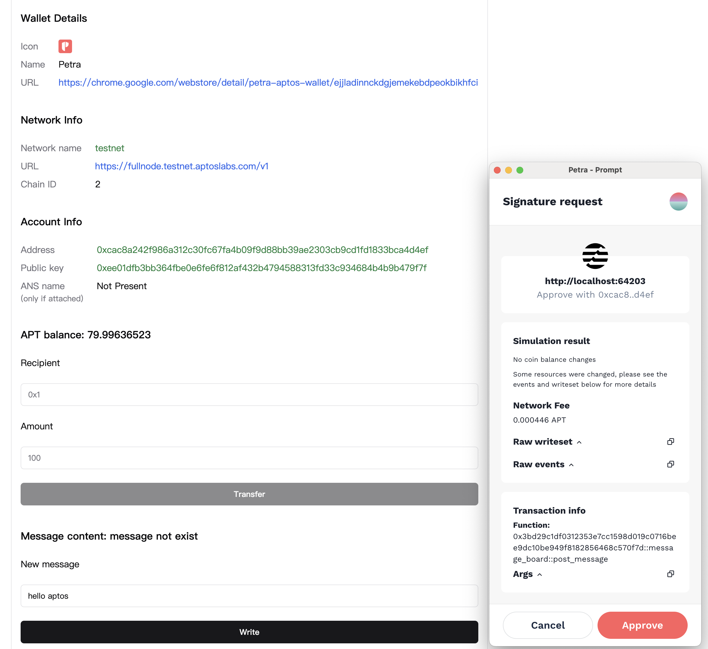
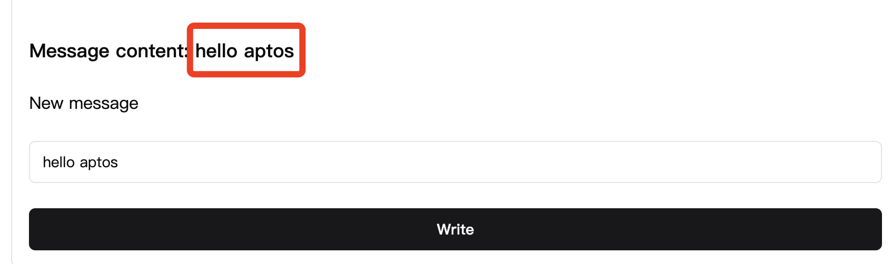

# Aptos DApp 开发入门

## 学习材料

https://aptos.dev/en/build/create-aptos-dapp

## 执行创建命令

```bash
$ pnpx create-aptos-dapp@latest

   ###    ########  ########  #######   ######
  ## ##   ##     ##    ##    ##     ## ##    ##
 ##   ##  ##     ##    ##    ##     ## ##
##     ## ########     ##    ##     ##  ######
######### ##           ##    ##     ##       ##
##     ## ##           ##    ##     ## ##    ##
##     ## ##           ##     #######   ######

Welcome to the create-aptos-dapp wizard 🌐
✔ Enter a new project name … js-aptos-dapp
? Choose how to start › - Use arrow-keys. Return to submit.
❯   Boilerplate Template - A Boilerplate template to start an Aptos dapp with
    NFT minting dapp
    Token minting dapp
    Token staking dapp
? Choose your network › - You can change this later
    Mainnet
❯   Testnet
    Devnet
✔ Help us improve create-aptos-dapp by collection anonymous data … no
✔ Do you want to make any changes to your selections? (Default is No) … no
✔ Scaffolding project in /root/Study/MDBook/intensive-colearning-aptos/src/codes/hello_aptos_dapp/js-aptos-dapp
Need to install dependencies, this might take a while - in the meantime:
📖 Visit the Boilerplate Template docs: https://aptos.dev/en/build/create-aptos-dapp/templates/boilerplate
⠋ Installing the dependencies...
✔ Scaffolding project in /root/Study/MDBook/intensive-colearning-aptos/src/codes/hello_aptos_dapp/js-aptos-dapp
Success! You're ready to start building your dapp on Aptos.
Next steps:
Run: cd js-aptos-dapp
Open in your favorite IDE && follow the README file
```

- **创建的`dapp`模板工程目录结构**

```bash
js-aptos-dapp/
├── LICENSE
├── README.md
├── components.json
├── contract                —— 合约代码
├── frontend                —— 前端代码
├── index.html
├── package.json
├── postcss.config.js
├── public                  —— 静态资源
├── scripts                 —— 脚本代码
├── tailwind.config.js
├── tsconfig.json
├── tsconfig.node.json
├── vite-env.d.ts
└── vite.config.ts
```

## 初始化账户

```bash
$ aptos init
Configuring for profile default
Choose network from [devnet, testnet, mainnet, local, custom | defaults to devnet]
testnet
Enter your private key as a hex literal (0x...) [Current: None | No input: Generate new key (or keep one if present)]

No key given, generating key...
Account 0x3bd29c1df0312353e7cc1598d019c0716bee9dc10be949f8182856468c570f7d doesn't exist, creating it and funding it with 100000000 Octas
Account 0x3bd29c1df0312353e7cc1598d019c0716bee9dc10be949f8182856468c570f7d funded successfully

---
Aptos CLI is now set up for account 0x3bd29c1df0312353e7cc1598d019c0716bee9dc10be949f8182856468c570f7d as profile default!
 See the account here: https://explorer.aptoslabs.com/account/0x3bd29c1df0312353e7cc1598d019c0716bee9dc10be949f8182856468c570f7d?network=testnet
 Run `aptos --help` for more information about commands
{
  "Result": "Success"
}
```

## 部署合约

```bash
$ aptos move publish --named-addresses message_board_addr=default
Compiling, may take a little while to download git dependencies...
UPDATING GIT DEPENDENCY https://github.com/aptos-labs/aptos-core.git
INCLUDING DEPENDENCY AptosFramework
INCLUDING DEPENDENCY AptosStdlib
INCLUDING DEPENDENCY MoveStdlib
BUILDING MessageBoard
package size 2084 bytes
Do you want to submit a transaction for a range of [268700 - 403000] Octas at a gas unit price of 100 Octas? [yes/no] >

Do you want to submit a transaction for a range of [268700 - 403000] Octas at a gas unit price of 100 Octas? [yes/no] >
yes
Transaction submitted: https://explorer.aptoslabs.com/txn/0x112a06807e1efb3c26972b017d4b9c1ee2eba94fc5868093427206babffa968f?network=testnet
{
  "Result": {
    "transaction_hash": "0x112a06807e1efb3c26972b017d4b9c1ee2eba94fc5868093427206babffa968f",
    "gas_used": 2687,
    "gas_unit_price": 100,
    "sender": "3bd29c1df0312353e7cc1598d019c0716bee9dc10be949f8182856468c570f7d",
    "sequence_number": 0,
    "success": true,
    "timestamp_us": 1725967632715580,
    "version": 5963473442,
    "vm_status": "Executed successfully"
  }
}
```

## 添加地址到`.env`文件

```
PROJECT_NAME=js-aptos-dapp
VITE_APP_NETWORK=testnet
VITE_MODULE_ADDRESS=0x3bd29c1df0312353e7cc1598d019c0716bee9dc10be949f8182856468c570f7d
```

## 启动服务

```bash
$ npm run dev
```

## 页面交互




