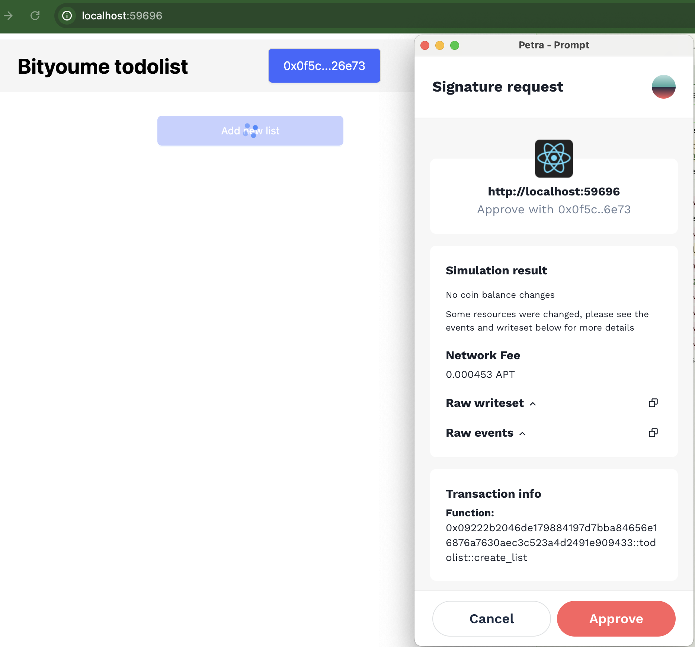
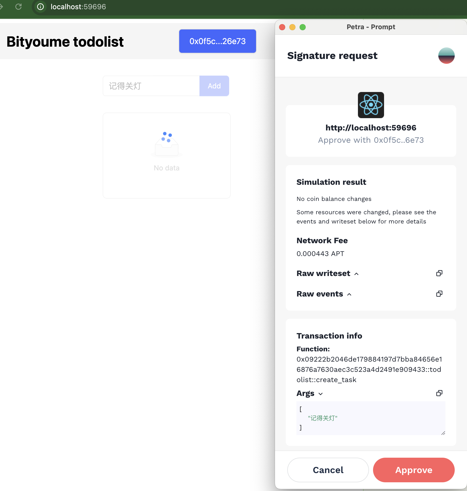
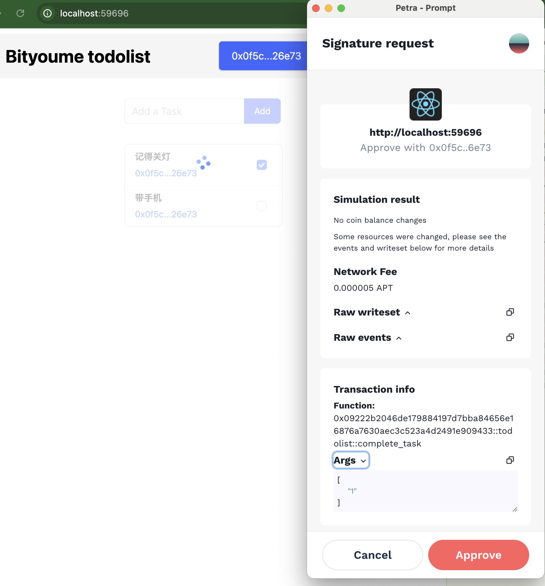
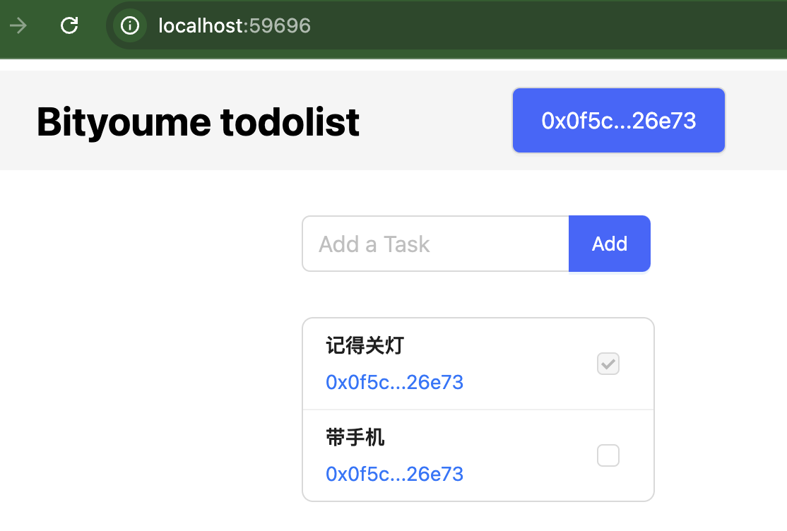

# 官方 Todolist 前端交互体验

## 发布官方Todolist合约

### 初始化账户

```bash
$ aptos init
Configuring for profile default
Choose network from [devnet, testnet, mainnet, local, custom | defaults to devnet]
testnet
Enter your private key as a hex literal (0x...) [Current: None | No input: Generate new key (or keep one if present)]

No key given, generating key...
Account 0x09222b2046de179884197d7bba84656e16876a7630aec3c523a4d2491e909433 doesn't exist, creating it and funding it with 100000000 Octas
Account 0x09222b2046de179884197d7bba84656e16876a7630aec3c523a4d2491e909433 funded successfully

---
Aptos CLI is now set up for account 0x09222b2046de179884197d7bba84656e16876a7630aec3c523a4d2491e909433 as profile default!
 See the account here: https://explorer.aptoslabs.com/account/0x09222b2046de179884197d7bba84656e16876a7630aec3c523a4d2491e909433?network=testnet
 Run `aptos --help` for more information about commands
{
  "Result": "Success"
}
```

### 发布合约

```bash
$ aptos move publish --named-addresses todolist_addr=default
Compiling, may take a little while to download git dependencies...
UPDATING GIT DEPENDENCY https://github.com/aptos-labs/aptos-core.git
INCLUDING DEPENDENCY AptosFramework
INCLUDING DEPENDENCY AptosStdlib
INCLUDING DEPENDENCY MoveStdlib
BUILDING my_todo_list
Do you want to submit a transaction for a range of [190300 - 285400] Octas at a gas unit price of 100 Octas? [yes/no] >
yes
Transaction submitted: https://explorer.aptoslabs.com/txn/0x18f2969ac50c1ad5b0c0e70bd666db729f71d62d2d27d88ac2bf28b918b34d13?network=testnet
{
  "Result": {
    "transaction_hash": "0x18f2969ac50c1ad5b0c0e70bd666db729f71d62d2d27d88ac2bf28b918b34d13",
    "gas_used": 1903,
    "gas_unit_price": 100,
    "sender": "09222b2046de179884197d7bba84656e16876a7630aec3c523a4d2491e909433",
    "sequence_number": 0,
    "success": true,
    "timestamp_us": 1726052998054573,
    "version": 5968275918,
    "vm_status": "Executed successfully"
  }
}
```

## 修改前端代码

-   **修改前**

```js
export const aptos = new Aptos();
// change this to be your module account address
export const moduleAddress = "0xcbddf398841353776903dbab2fdaefc54f181d07e114ae818b1a67af28d1b018";
```

-   **修改后**

```js
export const aptos = new Aptos(new AptosConfig({ network: Network.TESTNET }));
// change this to be your module account address
export const moduleAddress =
  "0x09222b2046de179884197d7bba84656e16876a7630aec3c523a4d2491e909433";
```

## 启动前端服务

```bash
$ pnpm i
$ pnpm start
```

## 功能交互

### 创建新的Todolist



### 创建新的待办



### 完成待办




